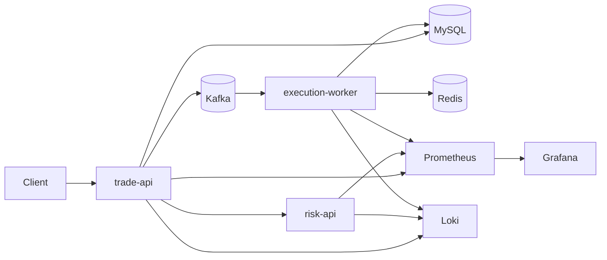

# Mock Trading Reliability Lab

주문 생성 → 리스크 검사 → 비동기 체결 처리 흐름을 가진 소형 분산 시스템을 만들고,  
JVM / DB / Kafka / Redis / Kubernetes / 네트워크 장애를 재현·관측·분석·자동화하기 위한 개인 홈랩 프로젝트입니다.

이 프로젝트의 목적은 실제 투자 서비스를 만드는 것이 아니라,  
**신뢰성 엔지니어링(SRE) 관점에서 장애를 재현 가능하게 설계하고 RCA(근본 원인 분석) 역량을 훈련하는 것**입니다.

---

## 목표

- Java / Spring Boot 기반 분산 시스템의 정상 흐름과 실패 흐름을 직접 구현
- 애플리케이션, JVM, DB, Kafka, Redis, 네트워크, Kubernetes 계층의 장애 시나리오 재현
- 로그 / 메트릭 / 대시보드 기반의 관측성 확보
- 반복적인 장애 분석 절차를 자동화하는 운영 도구 제작
- SLO / Alert / Post-mortem / RCA 문서화 연습

---

## 시스템 개요

### 주요 흐름

1. 클라이언트가 주문 생성 요청
2. `trade-api`가 `risk-api`에 동기 리스크 검사를 요청
3. 주문 승인 시 DB 저장 후 Kafka 이벤트 발행
4. `execution-worker`가 이벤트를 소비하여 체결 처리
5. 체결 결과와 포지션을 저장하고 Redis 캐시를 갱신/무효화

### 아키텍처



---

## 핵심 컴포넌트

### `trade-api`

- 주문 생성 / 조회 API 제공
- `risk-api` 동기 호출
- 주문 저장
- Kafka 이벤트 발행
- 포트폴리오 캐시 조회

### `risk-api`

- 주문 리스크 검사
- latency / error / CPU burn fault injection 제공
- 동기 의존성 장애 실험 대상

### `execution-worker`

- Kafka 이벤트 소비
- 주문 체결 처리
- 포지션 업데이트
- Redis 캐시 무효화 또는 갱신

---

## 장애 실험 범위

이 프로젝트는 아래 유형의 장애를 다루는 것을 목표로 합니다.

- `risk-api` 응답 지연 및 오류율 증가
- DB slow query 및 connection pool 고갈
- JVM heap pressure 및 GC pause 증가
- Kafka consumer lag / poison message / duplicate consume
- Redis hot key / cache miss burst / stale cache
- Kubernetes readiness/liveness probe 오설정
- CPU throttling / OOMKill
- 네트워크 지연 / 패킷 손실 / DNS 지연

---

## 기술 스택

- **Language**: Java 21
- **Framework**: Spring Boot 3, Spring MVC, Spring Data JPA, Spring Kafka
- **Database / Cache / Messaging**: MySQL, Redis, Kafka
- **Observability**: Prometheus, Grafana, Loki, Micrometer
- **Fault Injection / Load Test**: Toxiproxy, k6
- **Infra**: Docker Compose, kind(Kubernetes 예정)

---

## 저장소 구조

```text
mock-trading-reliability-lab/
├─ apps/
│  ├─ trade-api/
│  ├─ risk-api/
│  └─ execution-worker/
├─ modules/
│  ├─ contracts/
│  └─ test-support/
├─ infra/
│  ├─ compose/
│  └─ kind/
├─ load/
│  └─ k6/
├─ scripts/
├─ docs/
└─ README.md
```

---

## 현재 범위

초기 단계에서는 아래에 집중합니다.

- Docker Compose 기반 로컬 인프라 구성
- `trade-api` / `risk-api` / `execution-worker` 최소 기능 구현
- Prometheus / Grafana / Loki 연동
- 기본 fault injection 및 부하 테스트 시나리오 작성
- 첫 번째 RCA 문서와 runbook 작성

---

## 향후 계획

- [ ] 주문 생성 및 조회 API 구현
- [ ] 리스크 검사 및 fault injection 구현
- [ ] Kafka 기반 비동기 체결 처리 구현
- [ ] Redis 포트폴리오 캐시 구현
- [ ] Grafana 대시보드 작성
- [ ] k6 부하 시나리오 추가
- [ ] 장애 시나리오별 RCA 문서 작성
- [ ] `kind` 기반 Kubernetes 배포 및 운영 실험
- [ ] incident triage 자동화 도구 작성

---

## 프로젝트 원칙

- 기능보다 **재현 가능한 장애 시나리오**를 우선한다.
- 과도한 추상화보다 **관측 가능성과 분석 가능성**을 우선한다.
- “잘 동작하는가”보다 **왜 실패하는가를 설명할 수 있는가**를 더 중요하게 본다.
- 운영 자동화와 RCA 문서화를 프로젝트의 핵심 산출물로 간주한다.

---

## 비목표(Non-goals)

아래 항목은 현재 우선순위에서 제외합니다.

- 실제 투자 서비스 수준의 도메인 완성도
- 인증/인가
- 관리자 UI
- 실시간 시세 처리
- 복잡한 주문 타입
- 서비스 메시 / 대규모 클러스터 운영
- production-grade multi-broker Kafka

---

## Known Gaps

초기 버전에서는 다음과 같은 한계를 의도적으로 남겨둡니다.

- DB commit 이후 Kafka publish 실패 시 정합성 갭이 발생할 수 있음
- 분산 트랜잭션 / Outbox 패턴은 후속 단계에서 다룰 예정
- Kubernetes는 1차적으로 애플리케이션 계층만 실험 대상으로 올릴 예정

---

## Why this project?

이 프로젝트는 단순 CRUD 포트폴리오가 아니라,
다음 질문에 답할 수 있도록 설계된 실험실입니다.

- 왜 latency가 증가했는가?
- 병목은 JVM, DB, 네트워크, Kafka 중 어디에서 시작됐는가?
- 어떤 지표가 먼저 깨졌는가?
- 장애 분석 절차를 어떻게 자동화할 수 있는가?
- 재발 방지를 시스템에 어떻게 반영할 수 있는가?

---

## License

TBD
