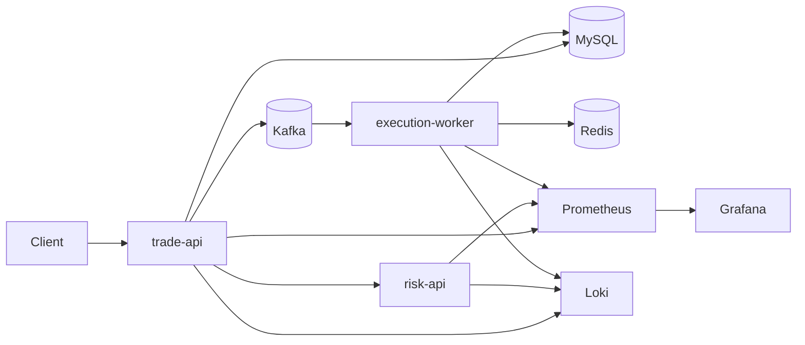

# Architecture Overview

- `trade-api` handles order creation, order lookup, and portfolio reads.
- `risk-api` provides synchronous risk checks and fault injection entry points.
- `execution-worker` consumes accepted-order events and updates execution state.
